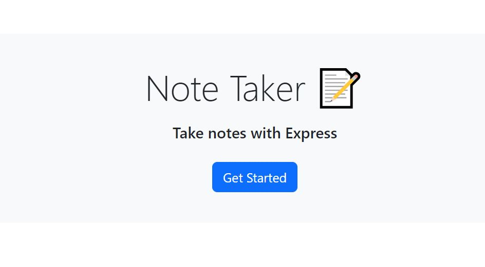
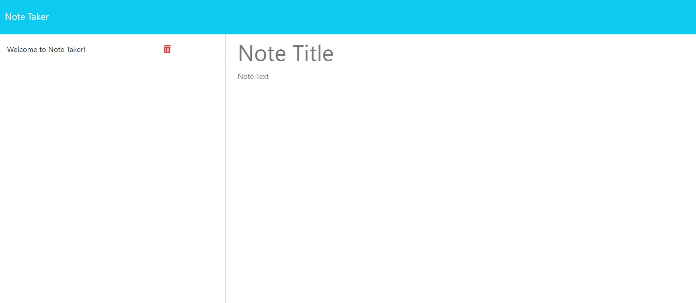
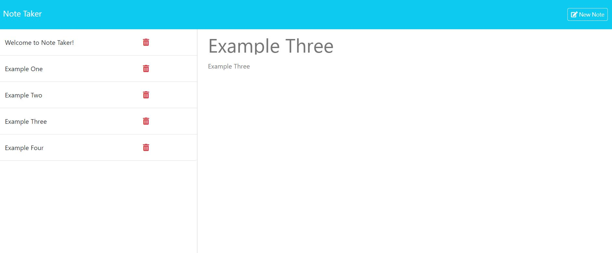

# Note Taker
Module 11 Challenge

## Description
This app was created for small business owneers, to be be able to organize and keep track of tasks by being able to write and save notes.

## Usage
To open the app, click the following link: \
https://notetakes-e8176ad7de83.herokuapp.com/

Once the application loads, to start clicke on the "Get Started" button.

Then you'll be taken to the notes page. See below preview.

To start taking notes add a title and text, then you'll be able to save your note, and create a new one. 

You can also navigate between notes to review again or you can delete them by clicking the trashcan next to the note title.

## Credits
Original code provided by UTA Bootcamp.

References: \
https://github.com/OwaisIslam/note-taker \
https://github.com/kara-krzystan/note-taker \
https://github.com/ryanzubayer/Express.js-Challenge-Note-Taker \
https://www.w3schools.com/git/git_ignore.asp \
https://www.freecodecamp.org/news/how-to-deploy-an-application-to-heroku/ \
ChatGPT

Debug:\
ChatGPT\
VSCode

